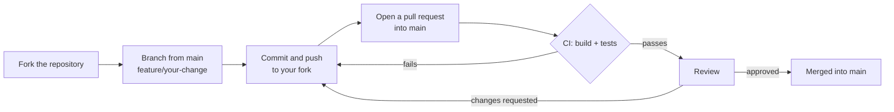

# Contributing to Panelglass

Thanks for helping. This guide covers how to send a change, how to build and test, and the rules that keep the app
safe. Open work is listed in the README [roadmap](README.md#roadmap); pick an item, or open an issue for your idea
first so nobody duplicates work.

## How to contribute

There is one long-lived branch, **`main`**. Every change reaches it through a pull request from a short-lived branch
in your fork; releases are version tags on `main`.



1. **Fork** the repository on GitHub and clone your fork.
2. **Start from `main`**:
   ```bash
   git remote add upstream <URL of this repository>   # once
   git fetch upstream
   git switch -c feature/<short-name> upstream/main
   ```

   Name the branch by kind: `feature/…` for new behaviour, `fix/…` for a bug, `docs/…` for documentation only.
3. **Commit** in focused steps, with messages in the imperative ("Add Claude engine", not "Added…"). Explain *why*
   in the body when it is not obvious.
4. **Keep your branch current** before opening the pull request: `git fetch upstream && git rebase upstream/main`.
5. **Open the pull request against `main`** and fill in the template. CI builds the app and runs the unit tests on
   every pull request; it must pass before review.
6. **Respond to review** by pushing more commits to the same branch. Once approved, the pull request is merged into
   `main`, and your change ships with the next release.

## Releases

A maintainer tags a commit on `main` with its version (`git tag v1.2.0 && git push origin v1.2.0`). The tag starts
`.github/workflows/release.yml`, which builds, signs and publishes the APK as a GitHub Release; a tag that is not on
`main` is refused. Nothing else publishes an APK.

## Building

Requirements: the Android SDK with platform 35, and **JDK 21** installed anywhere. Gradle finds it through
`gradle/gradle-daemon-jvm.properties`; AGP 8.x does not run on newer JDKs.

```bash
echo "sdk.dir=/path/to/Android/Sdk" > local.properties   # Android Studio writes this for you
./gradlew assembleDebug
./gradlew testDebugUnitTest :core:model:test
```

What each test class covers, the instrumented tests and the checks that need a phone are in
[docs/TESTING.md](docs/TESTING.md).

Never commit machine-specific paths. `local.properties` is ignored; do not add `org.gradle.java.home` to
`gradle.properties`.

If the build fails in `JdkImageTransform` with "jlink executable … does not exist", Gradle picked a Java runtime
without `jlink` (an IDE's bundled JRE, for example). Stop the daemon and point it at a full JDK 21 for that run:

```bash
./gradlew --stop
./gradlew assembleDebug "-Dorg.gradle.java.installations.auto-detect=false" \
  "-Dorg.gradle.java.installations.paths=/path/to/jdk-21"
```

Install your build with `adb install -r app/build/outputs/apk/debug/panelglass-*-debug.apk`. A debug build and a
release APK from the Releases page are signed with different keys, so Android will not install one over the other:
uninstall first (this clears the app's data).

## Before you open a pull request

- [ ] `./gradlew assembleDebug testDebugUnitTest :core:model:test` passes.
- [ ] New test classes are listed in [docs/TESTING.md](docs/TESTING.md).
- [ ] New behaviour has unit tests. Provider calls are tested against MockWebServer, never a live API.
- [ ] UI changes were checked in all four themes (Default, Panel Pop, Soft Bloom, Paper & Ink).
- [ ] Rendering changes bump `TranslationPipeline.PIPELINE_VERSION` (it keys the patch cache).
- [ ] Schema changes bump `PanelglassDb.version`.
- [ ] Changes to model loading, backends or release timing were re-measured on a phone
  ([docs/MEMORY_USAGE.md › Reproducing](docs/MEMORY_USAGE.md#reproducing)).
- [ ] Docs in `docs/` still describe what the code does.

## Rules that are easy to break

- **No secrets or personal data in logs or in the repo.** No API keys, page URLs, page text or user IDs in logs.
  HTTP bodies are never logged. Keys live only in `SecureKeyStore`.
- **Never switch engines silently.** A failing engine surfaces a typed `EngineFailure`; only transient failures are
  retried, on the same engine (`EngineRetry`).
- **No bundled site list or block list.** Block lists are fetched at runtime, on the user's device, directly from
  AdGuard, HaGeZi and StevenBlack (`BlockListRepository`). This is a licensing rule as well as a freshness one: the
  AdGuard and HaGeZi lists are GPL-3.0, so a copy in the repository or the APK, even as an offline fallback, would
  make the project a distributor of GPL-3.0 material with that licence's obligations. Fetched at runtime, Panelglass
  distributes none of them and stays Apache-2.0 (see [NOTICE](NOTICE)). The same goes for any new source: add its
  URL, never its content.
- **`shouldInterceptRequest` reads only `@Volatile` fields**: no Room, DataStore or network calls there.
- **Model downloads go through `SystemDownloads`** and are verified by SHA-256. Changing a model URL means changing its
  hash; URLs are pinned to a commit.
- **New dependencies** must be discussed in an issue first and added to `gradle/libs.versions.toml`.
- **Model loading stays off the main thread.**
- **A hidden app gives its models back.** An on-device model is released when the UI leaves the screen, or 5 s after
  its last call if it was busy then (`LocalEngines.onHidden`). New model code must go through `LocalEngines` so it is
  covered; on the GPU a loaded model is ~2–3 GB the system cannot reclaim.

## Code style

- Kotlin official style (`kotlin.code.style=official`); match the surrounding code.
- Comments say what the code does and why. Keep them free of ticket numbers, plan sections and dates.
- Compose UI reads colours from `Tokens` so every theme works.
- Reuse the card rows in `core/ui` `Components.kt`: `ValueRow` for a row that opens a list of choices (label, value
  right-aligned against its chevron), `ActionRow` for a row with a text action (Download / Delete), `ToggleCardRow`
  for a switch. Inside a dialog or sheet, whose content is already padded, use `SectionLabel(…, inset = 0.dp)` so the
  label lines up with the card under it.
- `ChoiceSheet`'s `render` and `subtitle` are plain lambdas, not composables: resolve strings with `stringResource`
  in the composable first and pass them in.
- **No hard-coded UI text.** Every user-visible string goes in `core/ui/src/main/res/values/strings.xml` and is read
  as `com.smnexstudio.panelglass.core.ui.R.string.*`. Add the key to every `values-*` translation (English is
  acceptable until a translator updates it), use `plurals` for counts, and keep product, engine and font names
  untranslated. Language names come from `Lang.uiName()`, never `Lang.displayName` (that is the English name the
  engines use). A new UI language needs a `values-*` folder and an entry in `app/src/main/res/xml/locales_config.xml`.

## Licensing

Panelglass is licensed under [Apache-2.0](LICENSE). By submitting a contribution you agree that it is licensed under
the same terms (Apache-2.0 section 5). Only add third-party files, such as fonts, models or assets, whose licence allows
redistribution, and list each one in [NOTICE](NOTICE).

## Reporting bugs

Include the device, Android version, engine and languages, and what you expected. For translation-quality or layout
bugs, attach a debug dump ([docs/FLOW.md › Diagnostics](docs/FLOW.md#diagnostics)); check it holds no private content
before you share it.
