<p align="center">
  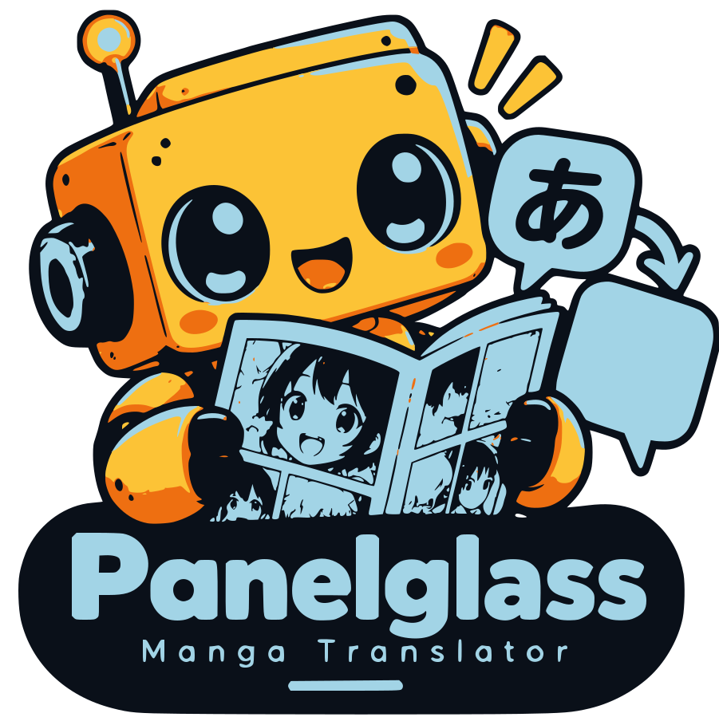
</p>

<h1 align="center">Panelglass: Real-Time Manga &amp; Webtoon Translator for Android</h1>

<p align="center">
  <strong>Read manga, manhwa and manhua in your language, translated in place as you scroll.</strong>
</p>

<p align="center">
  <a href="https://github.com/smnexstudio/Panelglass/releases/latest"></a>
  
  
  
  
  
  <a href="LICENSE"></a>
</p>

<p align="center">
  <a href="#screenshots">Screenshots</a> ·
  <a href="#features">Features</a> ·
  <a href="#why-panelglass">Why Panelglass</a> ·
  <a href="#how-it-works">How it works</a> ·
  <a href="#getting-started">Getting started</a> ·
  <a href="#documentation">Documentation</a> ·
  <a href="#faq">FAQ</a> ·
  <a href="#roadmap">Roadmap</a> ·
  <a href="CONTRIBUTING.md">Contributing</a>
</p>

---

Panelglass is an open-source **manga translator for Android**: a dedicated browser for the raw manga, manhwa,
manhua and webtoon sites you already read. It reads Japanese, Korean and Chinese comics and translates them directly
on your phone (offline with LiteRT-LM and manga-ocr) or with Gemini. Press **Start** and it translates the screen:
every speech balloon, caption and sound effect is erased and redrawn in your language, right where it was. Scroll,
and the next screen is translated as soon as the page settles; translations stay pinned to the art as it moves.

It works on any reader site because it translates **what is on screen** rather than downloading images: whatever a
site does with its pages, Panelglass sees the same pixels you do.


## Screenshots

<p align="center">
  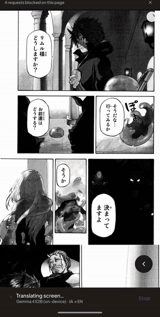
  <br>
  <sub>Real time, on a phone, fully offline (Gemma 4 E2B): the bubbles are redrawn in English as the model finishes them.<br>
  <a href="docs/ScreenRecordings/translate-while-scrolling.mp4">Watch the full recording</a> (70 s): translating while
  scrolling through a chapter; waiting stretches are sped up and labelled.</sub>
</p>

<table>
  <tr>
    <td align="center">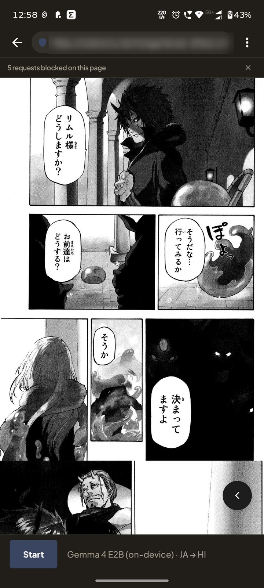</td>
    <td align="center">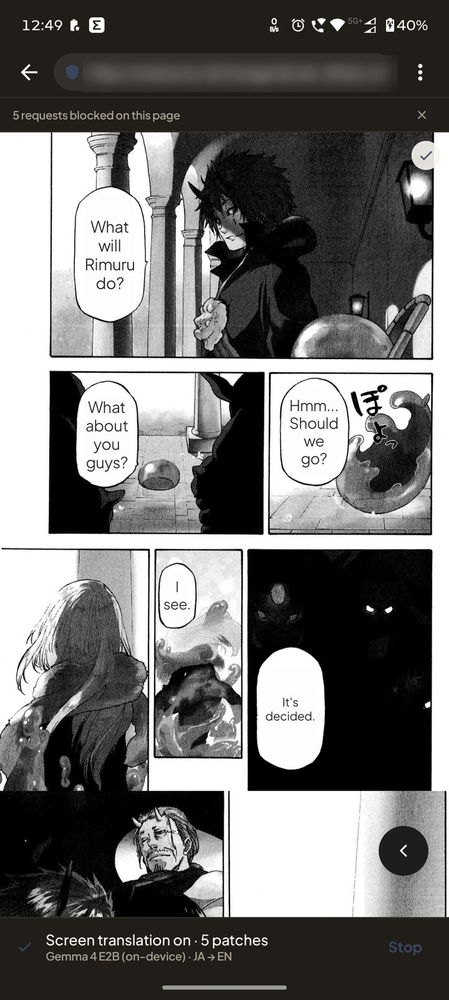</td>
    <td align="center">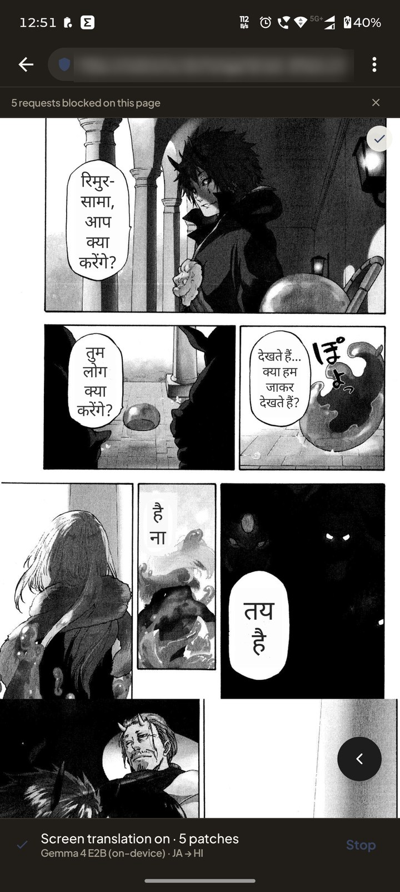</td>
  </tr>
  <tr>
    <td align="center"><sub>Before: the raw Japanese page</sub></td>
    <td align="center"><sub>After: translated into English, fully on device (Gemma 4 E2B)</sub></td>
    <td align="center"><sub>…or into Hindi</sub></td>
  </tr>
</table>

<table>
  <tr>
    <td align="center">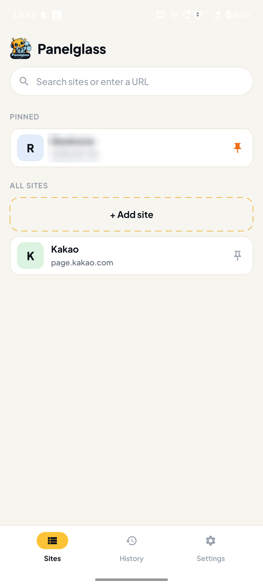</td>
    <td align="center">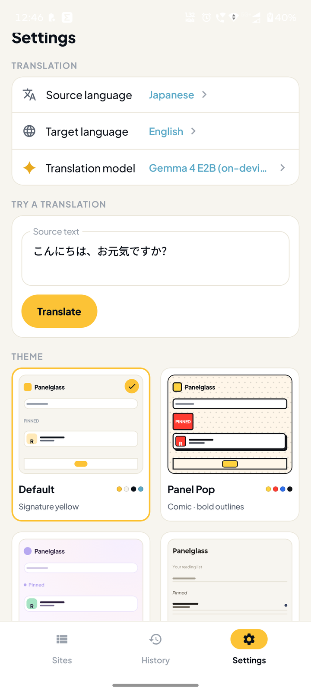</td>
    <td align="center">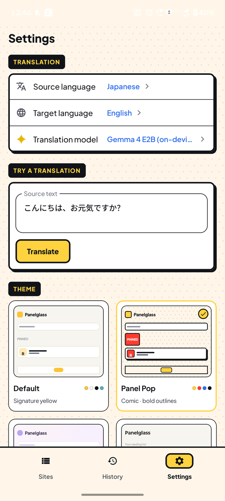</td>
    <td align="center">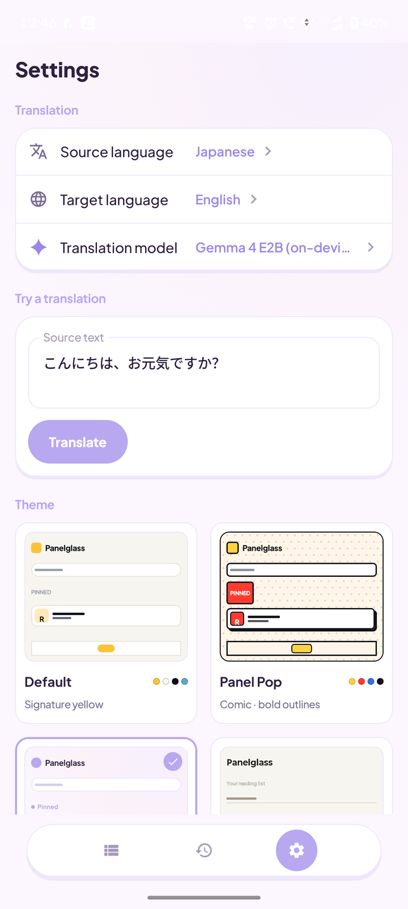</td>
    <td align="center">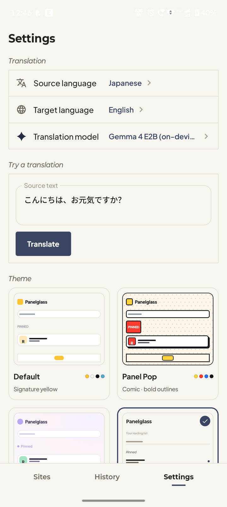</td>
  </tr>
  <tr>
    <td align="center"><sub>Your sites</sub></td>
    <td align="center"><sub>Default</sub></td>
    <td align="center"><sub>Panel Pop</sub></td>
    <td align="center"><sub>Soft Bloom</sub></td>
    <td align="center"><sub>Paper &amp; Ink</sub></td>
  </tr>
</table>

<sub>Site addresses are blurred. Artwork belongs to its creators and is shown only to demonstrate the translation.</sub>

## Features

- **In-place translation.** The original lettering is removed and the translation is fitted into the same balloon or
  caption box, sized to stay readable.
- **Your choice of engine**, cloud or fully offline:

  | Engine | Runs | Needs | Best for |
  |---|---|---|---|
  | **Gemini** | Google's API | Your own API key | Best quality and speed. Reads each balloon itself, so no on-device OCR is needed. Any Gemini or Gemma model your key can use. |
  | **Google Translate** | On device (ML Kit) | Nothing (~30 MB language packs) | Free and offline |
  | **Qwen 2.5 1.5B** | On device (LiteRT-LM; GPU, or CPU on phones under 6 GB) | One-time 1.6 GB download | Offline LLM translation |
  | **Gemma 4 E2B** | On device (LiteRT-LM, GPU when available) | One-time 2.6 GB download, 8 GB RAM | Offline LLM translation, higher quality |

- **Built for comics.** A bundled comic text and bubble detector finds the lettering; vertical Japanese is read by
  the optional manga-ocr model or by ML Kit with a rotated second pass.
- **Scrolling and paged readers.** Translations stay on their page image when the site shifts its layout, a page
  turn that does not scroll (tap or swipe readers) is noticed and translated, pages still downloading are picked up
  once they arrive, and rotating the phone translates the new layout.
- **Your sites, your list.** No sites ship with the app. Add the readers you use, pin favourites, and set languages,
  auto-translate and ad blocking per site.
- **Ad and pop-up blocking.** Merged public block lists (AdGuard DNS, HaGeZi pop-up ads), a native pop-up and
  popunder catcher, and cleanup of interstitials and tap-hijacking overlays.
- **Private by design.** Keys encrypted with the Android Keystore; offline engines keep everything on the device;
  no Panelglass server.
- **Translate the page itself.** ⋮ › *Translate page* translates the site's own text (titles, chapter lists,
  comments) in place, like Chrome's translate bar: the language is detected, English is the default target, and
  both can be changed. On-device with ML Kit; *Show original* puts the page back.
- **Four themes and three lettering fonts**, and a *Try a translation* box to check an engine before reading.
- **The app speaks your language.** The interface is in English by default and can be switched to any of the 15
  languages below (Arabic right to left) in Settings › App language.

**Languages.** Source: Japanese, Korean, Chinese (Simplified and Traditional), English, Spanish, French, German,
Italian, Portuguese, Russian, Indonesian, Vietnamese. Target: all of those, plus Thai, Arabic and Hindi.

### Download

<p align="center">
  <a href="https://github.com/smnexstudio/Panelglass/releases/latest"></a>
</p>

### Why Panelglass?

- **In-place bubble replacement (No floating overlays):** Unlike traditional screen translators that draw clunky floating boxes over the screen, Panelglass erases the original comic lettering and re-typesets the translation directly inside speech balloons, preserving the comic's original layout and artwork.
- **Scroll-anchored translations:** Translated patches are pinned to comic page elements in the DOM. As you scroll, pan, or rotate your device, translations remain locked to their artwork.
- **100% Offline AI translation:** Run on-device LLMs (Gemma 4 E2B, Qwen 2.5 1.5B via LiteRT-LM), manga-ocr, and ML Kit locally. Read raw comics anywhere with zero network requests and complete privacy.
- **Built-in ad and pop-up blocking:** Enjoy uninterrupted reading with integrated AdGuard and HaGeZi filters that eliminate mobile tap-hijacking, redirect loops, and pop-up ads.

## How it works

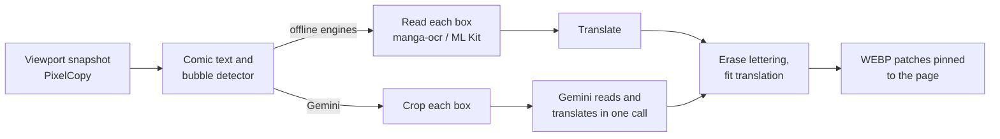

1. The WebView's viewport is captured (after a short wait for pages still downloading), and the page reports where
   its comic images are and which toolbars float above them, so only comic art is translated.
2. An RT-DETR-v2 detector finds balloons and text; balloons cut off by the screen edge wait until they are fully on
   screen.
3. Each text area is read on the device, or sent as a crop to Gemini, which reads and translates it in one call.
4. The lettering is erased, the translation is fitted into the same space, and each region becomes a small patch
   drawn over the page, anchored to its page image so it moves with it as you scroll.

With Gemini (`gemini-3.5-flash-lite`), one screen of a raw Japanese chapter (8 balloons) takes about **6–9 s** on the
emulator, against about 25 s through on-device OCR. On a phone, fully offline with Gemma 4 E2B, the first screen took
about 17 s and the next about 11 s; a dense page fills in four bubbles at a time, roughly every 15 s
([recording](docs/ScreenRecordings/translate-while-scrolling.mp4)).

## Getting started

### Install

Panelglass is not on Google Play. Each release is published on GitHub:

1. Open the [Releases](../../releases) page and download `panelglass-<version>.apk` from the latest release
   (Android 12 / API 31 or later; about 250 MB).
2. Optional but recommended: check the download against the `.sha256` file next to it
   (`sha256sum -c panelglass-<version>.apk.sha256`, or compare with `certutil -hashfile <apk> SHA256` on Windows).
3. Open the APK on your phone and allow your browser or file manager to install unknown apps when Android asks.
4. To update, install the newer APK over the old one; your sites, settings and downloaded models are kept.

### Set up

1. Open **Settings → Translation** and choose the source and target languages.
2. Choose an engine under **Translation model**. **Google Translate** is selected on a new install:
   - **Google Translate**: free and on the device. The Japanese, Korean and Chinese language packs (~30 MB each)
     download by themselves when the app first starts; English is built in. Any other language is downloaded only
     when you ask: tap **Download** when the reader says a pack is missing, or pick languages under **Models →
     Google Translate language packs**, where each one can also be deleted.
   - **Gemini**: tap its name, paste a key from [Google AI Studio](https://aistudio.google.com/apikey), pick a model
     (a *flash* or *flash-lite* model is fastest) and save.
   - **Qwen 2.5 1.5B** or **Gemma 4 E2B**: download the model under **Models**. The engine picker then shows it as
     *downloaded*. Qwen runs on the GPU, or on the CPU on phones under 6 GB of RAM (about 3× slower, but far less
     memory); **Settings → Models → Qwen runs on** changes it ([details](docs/MEMORY_USAGE.md)).
3. For Japanese with an offline engine, also download **Japanese manga OCR** (140 MB).
4. Check the setup with **Try a translation**, then add a site under **Sites**, open a chapter and press **Start**.
   **Stop** ends translation; **⋮ → Re-translate** reads the current screen again from scratch.

### Build from source

Requirements: the Android SDK (platform 35) and **JDK 21**. Gradle locates JDK 21 automatically through
`gradle/gradle-daemon-jvm.properties`; AGP 8.x does not run on newer JDKs.

```bash
git clone <repository-url> && cd Panelglass
echo "sdk.dir=/path/to/Android/Sdk" > local.properties   # Android Studio writes this for you
./gradlew assembleDebug
adb install -r app/build/outputs/apk/debug/panelglass-*-debug.apk
```

The APK is about 250 MB: it bundles the detector, ML Kit's Japanese, Korean, Chinese and Latin recognizers,
ONNX Runtime and the LiteRT-LM runtime. The language models are downloaded in the app. A build you make yourself is
signed with a different key from the published releases, so uninstall one before installing the other.

## Privacy

- **API keys** are encrypted with the Android Keystore (AES-GCM) and never logged. Requests go straight from your
  device to the provider.
- **Translate page** runs on the device (ML Kit language identification and translation); page text is never sent
  anywhere.
- **With Gemini**, crops of the text on your screen are sent to Google to be read and translated. With Google
  Translate, Qwen or Gemma 4, translation happens on the device.
- **https only**: the app sends nothing in clear text. An `http://` address or link is opened as `https://`, and a
  site that only serves plain http will not load.
- **Links from other apps** open in the reader but are never translated automatically, even with
  translate-on-open on: you tap Start yourself.
- **Logs** contain timings and failure types only: no keys, page URLs or page text.
- **Other network use**: the block lists ([AdGuard DNS filter](https://adguardteam.github.io/AdGuardSDNSFilter/Filters/filter.txt),
  [HaGeZi pop-up ads](https://github.com/hagezi/dns-blocklists), [StevenBlack hosts](https://github.com/StevenBlack/hosts)
  as a fallback), and the model downloads you start (Hugging Face; Google for ML Kit language packs). Every model
  file is verified against a pinned SHA-256.
- **Uninstalling** removes everything the app stored; nothing is backed up.

## Documentation

| Document | Contents |
|---|---|
| [docs/ARCHITECTURE.md](docs/ARCHITECTURE.md) | Modules, components, engines, storage, concurrency, security model |
| [docs/FLOW.md](docs/FLOW.md) | A screen's journey: capture → pipeline → translation → rendering → overlay; failures; diagnostics |
| [docs/DETECTION_AND_OCR.md](docs/DETECTION_AND_OCR.md) | The comic text and bubble detector, recognizers, regions and classification |
| [docs/MEMORY_USAGE.md](docs/MEMORY_USAGE.md) | RAM per engine on a phone: running, translating, in the background, cleared |
| [docs/TESTING.md](docs/TESTING.md) | Every test class and what it covers, instrumented tests, checks on a phone, gaps |
| [CONTRIBUTING.md](CONTRIBUTING.md) | Branch model, build, pull request checklist, rules |

### Project structure

```
app/                  MainActivity, navigation, application class
core/model/           Pure Kotlin types: languages, engines, failures, regions, settings
core/data/            Room, DataStore settings, encrypted key store, patch cache, verified downloads
core/engine/          Engine registry and retry policy; Gemini, ML Kit translation, on-device LLMs
core/ocr/             Comic text/bubble detector (ONNX), manga-ocr and ML Kit recognizers, region building
core/render/          Text erasing and fitting; each region becomes a WEBP patch
core/pipeline/        TranslationPipeline: detect → read → translate → render, with per-stage watchdogs
core/ui/              Shared Compose components, themes, engine picker, key sheet, all UI strings (16 languages)
feature/browser/      Reader: WebView, capture, patch overlay, ad and pop-up blocking
feature/library/      Sites and history
feature/settings/     Languages, engines, models, fonts, themes, storage
docs/                 Architecture, flow and detection/OCR documentation
```

### Development

```bash
./gradlew testDebugUnitTest :core:model:test      # unit tests (JUnit 5 + Robolectric)
./gradlew :core:data:connectedDebugAndroidTest    # key store on a device
./gradlew :core:pipeline:connectedDebugAndroidTest  # whole pipeline on a device
```

- Provider requests are tested against MockWebServer; the on-device LLM is replaced by a scripted runner in JVM tests.
- A **debug dump** of any translated screen (snapshot, regions, fitting decisions, patches) is described in
  [docs/FLOW.md](docs/FLOW.md#diagnostics).

## Roadmap

Contributions are welcome. Pick an item, open an issue to say you are on it, and follow
[CONTRIBUTING.md](CONTRIBUTING.md). Items marked **good first issue** need little context.

### Engines

- [ ] **Claude** (`llm/ClaudeEngine`): verify the Messages API on a device; add a model dropdown.
- [ ] **OpenAI** (`llm/OpenAiEngine`): verify on a device; model dropdown from `/v1/models`.
- [ ] **OpenRouter** (`llm/OpenRouterEngine`): verify on a device; model dropdown from `/api/v1/models`.
- [ ] **DeepSeek** (`llm/DeepSeekEngine`): verify on a device (text only).
- [ ] **DeepL** (`mt/DeepLEngine`): verify the free and pro hosts, and glossary context.
- [ ] **Papago** (`mt/PapagoEngine`): verify the NCP endpoint and key pair.

These exist as `@PlannedEngine` placeholders: request formats are unit-tested, but none has run against the real
service. To offer one, finish its checks, set `offered = true` on its `EngineId`, remove `@PlannedEngine`, and add a
model list if the provider hosts several (see `GeminiEngine.listModels`).

### Quality and performance

- [ ] Gemini mode: recover text the detector misses (a cheap backstop or a second-pass prompt).
- [x] Keep translations across zoom changes instead of clearing them.
- [ ] Re-render patches sharply after a large zoom-in (today the bitmap made at the old zoom is scaled).
- [ ] Use panel boundaries (`PanelCutter`) when placing free text, not just the image bounds.

### App

- [ ] Opt-in backup of sites and settings (never API keys).
- [ ] Native-speaker review of the UI translations (`core/ui/src/main/res/values-*`). **good first issue**
- [ ] Accessibility pass: content descriptions, touch targets, contrast in every theme. **good first issue**


## Frequently Asked Questions (FAQ)

### How does Panelglass translate manga and manhwa in real time?
Panelglass captures the web reader viewport and uses an RT-DETR-v2 detector to locate speech balloons and text boxes. It cleans the original Japanese, Korean, or Chinese lettering and fits the translated text into the balloon, pinning lightweight WebP patches directly to the comic page as you scroll.

### Can I translate manga completely offline without an internet connection?
Yes. Panelglass supports fully offline translation using on-device models including **Gemma 4 E2B**, **Qwen 2.5 1.5B** (via LiteRT-LM), **manga-ocr**, and **Google ML Kit**. Once model packs are downloaded, no data leaves your device.

### How does in-place translation differ from standard screen translators?
Standard screen translators typically place opaque floating popups or subtitle banners over the screen, blocking the artwork. Panelglass erases the original lettering inside the bubble and re-renders translated text formatted to fit the speech balloon, preserving the original panel art.

### Which comic languages and scripts are supported?
Panelglass translates from **Japanese** (including vertical text), **Korean**, **Chinese** (Simplified and Traditional), **English**, **Spanish**, **French**, **German**, **Italian**, **Portuguese**, **Russian**, **Indonesian**, and **Vietnamese** into all of those languages plus **Thai**, **Arabic** (with RTL text support), and **Hindi**.

### Does Panelglass require an API key?
An API key is only required if you choose the cloud-based **Gemini** engine (which uses free-tier keys from Google AI Studio). If you choose Google Translate (ML Kit), Qwen 2.5, or Gemma 4, no API key is required.

### Where can I download the Panelglass APK?
Panelglass is an open-source project distributed directly via [GitHub Releases](../../releases). It is not hosted on Google Play.


## Acknowledgements

- Comic text and bubble detector by [ogkalu](https://huggingface.co/ogkalu) (RT-DETR-v2, Apache-2.0).
- [manga-ocr](https://github.com/kha-white/manga-ocr) by kha-white, via the
  [l0wgear/manga-ocr-2025-onnx](https://huggingface.co/l0wgear/manga-ocr-2025-onnx) export.
- [Qwen2.5-1.5B-Instruct](https://huggingface.co/litert-community/Qwen2.5-1.5B-Instruct) (Alibaba, Apache-2.0) and
  [Gemma 4 E2B](https://huggingface.co/litert-community/gemma-4-E2B-it-litert-lm) (Google), LiteRT-LM builds by
  litert-community, run with [LiteRT-LM](https://github.com/google-ai-edge/LiteRT-LM).
- [ONNX Runtime](https://onnxruntime.ai) and [ML Kit](https://developers.google.com/ml-kit) text recognition and
  translation.
- Block lists by [AdGuard](https://github.com/AdguardTeam/AdGuardSDNSFilter), [HaGeZi](https://github.com/hagezi/dns-blocklists)
  and [StevenBlack](https://github.com/StevenBlack/hosts).
- Lettering fonts: Plus Jakarta Sans (SIL Open Font License, `core/ui/PlusJakartaSans-OFL.txt`), and from Google
  Fonts, Coming Soon by Open Window and Luckiest Guy by Astigmatic (both Apache-2.0).

Model files keep their own licences; check each model card before redistributing them.

## Disclaimer

Panelglass is a reading aid. It ships with no content and no site list. Respect the terms of the sites you visit and
the rights of creators and publishers, and support official releases where they exist.

## License

Copyright 2026 smnexstudio.

Panelglass is licensed under the [Apache License, Version 2.0](LICENSE). You may use, modify and distribute it,
including commercially, provided you keep the copyright and licence notices and state significant changes.

The licence covers the Panelglass source code and documentation. Third-party files in this repository (the
detector model and the fonts) keep their own licences, listed in [NOTICE](NOTICE); downloaded models keep theirs.
