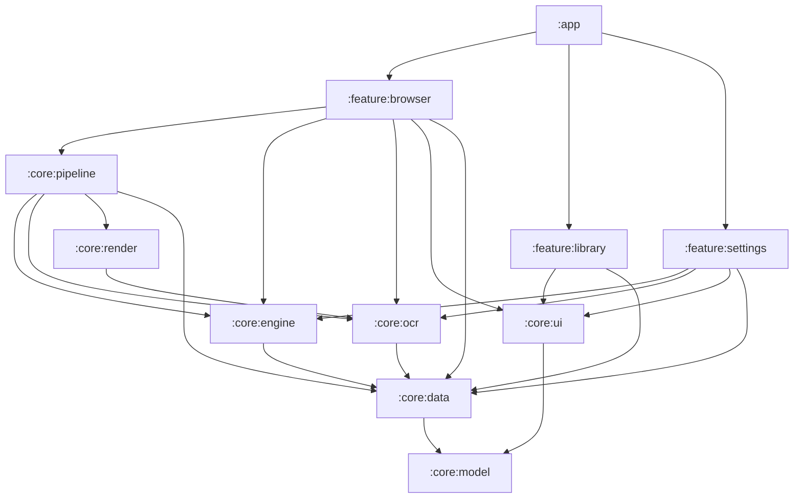
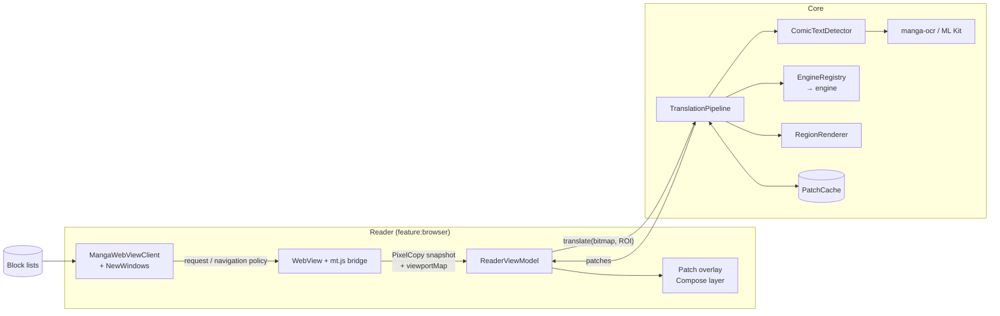

# Architecture

Panelglass is a single-activity Android app (Kotlin, Jetpack Compose, Hilt) split into Gradle modules by layer. This
document covers the module layout, the main components and how they talk, storage, concurrency and the security
model. The translation flow itself is in [FLOW.md](FLOW.md); detection and OCR in [DETECTION_AND_OCR.md](DETECTION_AND_OCR.md).

## Contents

- [Principles](#principles)
- [Modules](#modules)
- [Runtime components](#runtime-components)
- [Engines](#engines)
- [Storage](#storage)
- [Concurrency and memory](#concurrency-and-memory)
- [Security and privacy](#security-and-privacy)
- [Testing](#testing)

## Principles

1. **Translate what the user sees.** The reader never downloads page images. It snapshots the WebView's viewport,
   so it works on any site, whatever the site does with its images (canvas, blob URLs, scrambled tiles).
2. **One pipeline, one entry point.** `TranslationPipeline.translate` is the only way pixels become translations.
3. **Patches, not pages.** The output is a small WEBP per text region, positioned in the page's CSS pixels and drawn
   natively over the WebView, so it scrolls and zooms with the art. The page's DOM is never modified by the translator.
4. **The user's engine is the engine.** A failing engine surfaces a typed failure; it is never silently replaced by
   another provider.
5. **Nothing secret or personal in logs or in the repo.** API keys live only in an Android-Keystore-backed store.

## Modules

Every module also depends on `:core:model`; those edges are left out for readability.

| Module | Responsibility | Key types |
|---|---|---|
| `:core:model` | Pure Kotlin, no Android. The shared vocabulary. | `Lang`, `EngineId`, `EngineFailure`, `TextLine`, `TextRegion`, `RegionKind`, `TranslateConfig`, `Settings`, `Site` |
| `:core:data` | Persistence and secrets. | `PanelglassDb` (Room), `SettingsRepository` (DataStore), `SecureKeyStore`, `PatchCache`, `SystemDownloads` |
| `:core:engine` | Everything that turns source text into target text. | `TranslationEngine`, `EngineRegistry`, `EngineRetry`, `BatchingTranslator`, `GeminiEngine`, `GoogleTranslateEngine`, `LocalLlmEngine` |
| `:core:ocr` | Finding and reading text in a bitmap. | `ComicTextDetector`, `MangaOcrRecognizer`, `MlKitCropRecognizer`, `RegionBuilder`, `RegionClassifier`, `RegionClusterer` |
| `:core:render` | Erasing source text and drawing the translation. | `TextEraser`, `RegionRenderer`, `Placement`, `PatchEncoder` |
| `:core:pipeline` | Orchestration: stages, limits, watchdogs, cache. | `TranslationPipeline`, `RegionOfInterest`, `PageSource`, `PipelineDump` |
| `:core:ui` | Shared Compose components and theming. | `PanelglassTheme`, `Tokens`, `EnginePicker`, `ApiKeyDialog` |
| `:feature:browser` | The reader: WebView, capture, overlay, blocking. | `ReaderScreen`, `ReaderViewModel`, `ScreenTranslate`, `ContentChange`, `MangaWebViewClient`, `NewWindows`, `BlockList`, `mt.js` |
| `:feature:library` | Saved sites and history. | `LibraryScreen`, `HistoryScreen`, `LibraryViewModel` |
| `:feature:settings` | Languages, engines, models, themes, storage. | `SettingsScreen`, `SettingsViewModel` |
| `:app` | Activity, navigation graph, application class. | `MainActivity`, `PanelglassApp` |

Dependencies point downwards only: features never depend on each other, and `:core:model` depends on nothing.

## Runtime components

- **`ReaderViewModel`** owns the reader session: the WebView itself (kept across trips to Settings through a
  `MutableContextWrapper`), the resolved `TranslateConfig`, the screen-translation session and its patches, and what
  triggers the next capture: a settled scroll, pages that finish downloading, a page turn without a scroll
  (`ContentChange`), a rotation. It keeps each patch anchored to its page image so it follows layout shifts.
- **`mt.js`** is injected into every page. It reports where the page's images are (with a key per image), how many
  are still loading, and which controls float over them (`viewportMap()`); it also hides full-screen interstitials
  and disables `window.open`. `mt.js` and `pt.js` go in at document start (`WebViewCompat.addDocumentStartJavaScript`),
  before any page script, and `__mt`/`__pt` are read-only frozen objects, so a page cannot stand in for the bridge.
  Replies over `MAX_BRIDGE_REPLY` characters are dropped unparsed.
- **`MangaWebViewClient`** blocks requests to hosts on the merged block lists and enforces the navigation policy
  (no cross-site redirects without a tap, no ad hosts as the main frame, only `mailto:`/`tel:`/`sms:` leave the
  app). **`NewWindows`** decides every new-window request: only a tapped same-site link opens, in the reader.
- **`EngineRegistry`** resolves the selected `EngineId` to an engine, or to a typed failure (`MissingKey`,
  `ModelMissing`, not offered). It never picks a different engine.

## Engines

| Engine | `EngineId` | Where it runs | Reads the crop itself |
|---|---|---|---|
| Gemini (and Gemma via the Gemini API) | `GEMINI` | Google API, user key | Yes: one call reads and translates |
| Google Translate | `GOOGLE` | On device (ML Kit translation) | No |
| Qwen 2.5 1.5B | `QWEN15_LOCAL` | On device (LiteRT-LM) | No |
| Gemma 4 E2B | `GEMMA4_LOCAL` | On device (LiteRT-LM), 8 GB RAM devices | No |

Claude, OpenAI, OpenRouter, DeepSeek, DeepL and Papago exist in code as `@PlannedEngine` placeholders: hidden from
the picker and refused by the registry.

- **Retries.** Only transient failures are retried, on the same engine and model (`EngineRetry`): rate limits up to
  3 times, overload (HTTP 500/502/503/504/529) up to 2 times, back-off capped at 4 s.
- **Cloud contract.** LLM engines exchange a JSON array of `{i, text}` items (`LlmContract`); Gemini's reading mode
  returns `{i, source, text}`.
- **On-device contract.** The LiteRT-LM models share one KV cache between prompt and reply (4096 tokens), so they get
  compact numbered lines (`3: translation`) in chunks of at most 12 items, and the reply is streamed and cut as soon
  as every requested line is complete. Only one on-device model is loaded at a time (`LocalEngines`).
- **On-device GPU.** LiteRT-LM tries its GPU backend first and falls back to the CPU. The GPU backend uses the
  vendor's OpenCL library, which from Android 12 an app can load only if the manifest declares it
  (`<uses-native-library>` for `libOpenCL.so`, `libOpenCL-car.so`, `libOpenCL-pixel.so`, `libvndksupport.so`, all
  optional). Without them the GPU backend fails with "OpenCL not supported" and the models run on the CPU.
- **Qwen's backend** (`Settings.qwenBackend`, Settings › Models › *Qwen runs on*): Automatic (default) takes the CPU
  on phones under 6 GB of RAM (`DeviceMemory.qwenOnCpu`), the GPU otherwise; GPU or CPU can be forced. On the CPU
  Qwen is about 3× slower, but its weights stay a memory-mapped file the system can reclaim (~0.6 GB pinned instead
  of ~2.8 GB; see [MEMORY_USAGE.md](MEMORY_USAGE.md)). The choice is read at each load, and a model loaded on the
  other backend is reloaded on its next call.

## Storage

| What | Where | Notes |
|---|---|---|
| Sites, history (last 15), SFX translations | Room `PanelglassDb` | No migrations yet: bump the version on schema change |
| Settings | DataStore | Includes remembered Gemini request options per model |
| API keys | `SecureKeyStore` | AES-GCM, key in the Android Keystore |
| Rendered patches | `PatchCache` (disk LRU) | Keyed by image hash, languages, engine and `PIPELINE_VERSION` |
| Detector model | `assets/` → `filesDir/models/` | Bundled, 11 MB |
| LLMs, manga-ocr | App-specific external storage | Downloaded by DownloadManager, SHA-256 verified |
| Block lists | `filesDir/blocklist/<source>.txt` | Fetched at runtime, refreshed daily |

`android:allowBackup="false"` plus `data_extraction_rules.xml` (which excludes every domain from cloud backup and from
device-to-device transfer, which Android 12+ would otherwise still do): nothing is backed up or copied to a new
phone, and everything is removed on uninstall.

## Concurrency and memory

- Pipeline stages have their own limits because they contend for different resources: decode 2, detect 2,
  cloud translate 6, on-device translate 1, render 2. A slow engine call does not stop the next capture from
  detecting.
- Each stage has a 50 s watchdog; a timeout fails that image only, with a typed failure.
- Model loading never happens on the main thread. The reader pre-warms the detector, OCR and engine when it opens.
- Patches more than three screens away from the viewport are dropped and re-made on return.
- `PanelglassApp.onTrimMemory` releases idle on-device models and manga-ocr sessions under memory pressure
  (`TRIM_MEMORY_RUNNING_LOW` and above), and logs that it did. When the UI is hidden (`TRIM_MEMORY_UI_HIDDEN`), a
  translator still busy is released 5 s after its last call (`LocalEngines.onHidden`), unless the app comes back
  first (`onVisible`, from the activity callbacks).

## Security and privacy

- **Keys.** Stored only in `SecureKeyStore`; never logged. HTTP bodies are never logged (they can echo a key).
- **Logs.** Timings and failure types only: no keys, page URLs, page text or user IDs.
- **Exported activity.** `MainActivity` accepts a `url` from other apps but loads only `http(s)`. The scripted-run
  extras (`engine`, `src`, `tgt`, `start`) are honoured only in debuggable builds.
- **WebView.** No file or content access; no JavaScript interface is exposed to pages; new windows are decided
  natively; blocked hosts never become the main frame.
- **Downloads.** Every model file is pinned to a Hugging Face commit and verified against its SHA-256 before it is
  used; mismatches are deleted. App-specific external storage is private to the app on every supported version
  (Android 12+).

## Testing

| Suite | Command | Covers |
|---|---|---|
| Unit (JVM, Robolectric) | `./gradlew testDebugUnitTest :core:model:test` | Engines against MockWebServer, the LLM contracts, retry policy, block lists, region building, text fitting, patch anchoring and page-change detection, Qwen's backend choice and the release of a model busy when the UI is hidden, download integrity |
| Instrumented | `./gradlew :core:data:connectedDebugAndroidTest` | `SecureKeyStore` round-trip on a device |
| Instrumented | `./gradlew :core:pipeline:connectedDebugAndroidTest` | A rendered page through the whole pipeline |

LiteRT-LM is never loaded in JVM tests: `LocalLlmEngine.runnerFactory` is replaced by a scripted `LlmRunner`.
