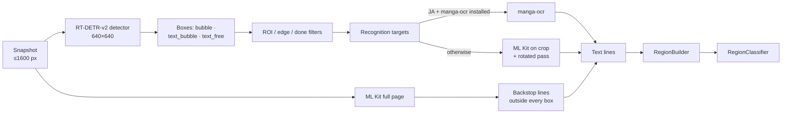

# Detection and OCR

How Panelglass finds text in a comic screenshot and reads it. The stages sit between the capture and the translation
step described in [FLOW.md](FLOW.md). Source: `core/ocr` and the detection part of `TranslationPipeline`.

## Contents

- [Overview](#overview)
- [Comic text and bubble detector](#comic-text-and-bubble-detector)
- [Filtering before reading](#filtering-before-reading)
- [Recognition targets](#recognition-targets)
- [Recognizers](#recognizers)
- [The recall backstop](#the-recall-backstop)
- [Gemini reading mode](#gemini-reading-mode)
- [From lines to regions](#from-lines-to-regions)
- [Region classification](#region-classification)
- [Reading order](#reading-order)
- [Tuning and measuring](#tuning-and-measuring)

## Overview

Detection is two-tier. A comic-specific detector finds the **containers** (balloons and text areas). A recognizer
then reads **each container crop**, and a full-page ML Kit pass catches text the detector missed.

If the detector model cannot be loaded, the page falls back to ML Kit alone.

## Comic text and bubble detector

`ComicTextDetector` runs [`ogkalu/comic-text-and-bubble-detector`](https://huggingface.co/ogkalu): an RT-DETR-v2
model exported to INT8 ONNX (Apache-2.0, 11 MB), bundled in `core/ocr/src/main/assets/` and run on ONNX Runtime's CPU
provider (`OrtCpu.options`).

| | |
|---|---|
| Input `images` | 1×3×640×640 float, RGB in 0..1. The snapshot is squashed to 640×640 without keeping its aspect ratio. |
| Input `orig_target_sizes` | `[w, h]` of the source bitmap, so boxes come back in source pixels |
| Output `labels` | `0` bubble (the balloon), `1` text_bubble (text inside a balloon), `2` text_free (text on art or in a caption) |
| Output `boxes` | `xyxy` in source pixels |
| Output `scores` | Confidence |

Post-processing (the model is anchor-free and needs no NMS):

- Detections under **0.30** confidence, or with a side under 4 px, are dropped.
- Same-class boxes with IoU ≥ **0.90** are near-duplicates; the higher score is kept.

The snapshot is first downscaled so its long side is at most **1600 px** (`ImageDecoder.forDetection`); boxes are
mapped back by the inverse scale. The ONNX file is copied once from assets to `filesDir/models/`, because ONNX
Runtime opens models by path, and it is pinned by its exact size. One session is shared behind a mutex.

## Filtering before reading

Per-crop OCR is the slowest stage, so boxes the pipeline will discard are removed **before** they are read
(`detectPage(..., skipRead)`). A box is skipped when:

1. it lies outside every image rect the page reported, or under a floating control (`RegionOfInterest`);
2. it is (almost) entirely inside a patch an earlier capture already made (`done`, 80% coverage);
3. it is a text box touching the top or bottom edge of the snapshot, so the bubble is cut. Its rectangle is kept as
   *deferred* and translated once a later capture shows it whole.

## Recognition targets

Text boxes (`text_bubble`, `text_free`) are what gets read. A `bubble` with no text box inside it is read whole, so a
balloon the text head missed is not lost. Targets are chosen from the full box list *before* filtering, so a balloon
whose text box was skipped is not mistakenly read whole.

Each target is cropped with **6% padding** (at least 2 px). Recognized lines are mapped back to page space and
trimmed to the unpadded box, so the padding never becomes part of an erase rectangle.

## Recognizers

### manga-ocr (Japanese, optional download)

`MangaOcrRecognizer` runs [manga-ocr](https://github.com/kha-white/manga-ocr) through the
[l0wgear/manga-ocr-2025-onnx](https://huggingface.co/l0wgear/manga-ocr-2025-onnx) export: a ViT-Small encoder and a
BERT-style decoder (~140 MB, fp32), verified by SHA-256 on download.

- Trained on Manga109 bubble crops, so the **whole crop** is fed: grayscale → RGB, resized to 224×224, normalised to
  `(x/255 − 0.5)/0.5`. No line splitting, no deskewing.
- Greedy decoding from `[CLS]` until `[SEP]` or 48 tokens. The export has no KV cache, so the decoder re-runs on the
  growing sequence each step. Batching or parallel crops were benchmarked and did not help.
- Output is one line per crop, flagged vertical when the crop is taller than wide, with a `fontSizePx` hint derived
  from area per character (the box spans several columns, so its size says little about the glyphs).
- Used for Japanese whenever it is installed. Its sessions are released under memory pressure.

### ML Kit on the crop (every other case)

`MlKitCropRecognizer` uses the bundled ML Kit recognizers (Japanese, Korean, Chinese, Latin):

- **Scaling** (`CropScalePlan`): ML Kit reads CJK best well above ~24 px glyphs, so small crops are enlarged (up to 3×)
  until the short side reaches 1200 px, and large crops are shrunk so the long side stays under 3000 px.
- **Rotated "shadow" pass** for Japanese: when the upright reading of a tall crop is weak (nothing, or scattered
  one- and two-character fragments, which is how ML Kit fails on vertical text), the crop is read again rotated ±90°
  so each column becomes a row. The reading with the most CJK characters wins; rotated results are mapped back and
  marked vertical.
- **Line angle.** ML Kit reports a vertical Japanese column at about ±90°. The translation is never drawn on its side
  or upside down, so only the tilt off the nearest axis is kept, within ±45° (`uprightTilt`). Without this, vertical
  dialogue was classified `IN_SCENE` and its translation drawn turned 90°, tiny and unreadable.

## The recall backstop

In parallel with the crops, ML Kit reads the **whole snapshot**. A backstop line is kept only if its centre lies in no
detector box and it overlaps every box by less than 35%. This recovers text the detector missed without duplicating
text it found.

## Gemini reading mode

When the engine reads images itself (`EngineId.readsCrops`, currently Gemini), detection runs with `read = false`:

- no manga-ocr, no ML Kit on crops and no full-page backstop;
- one `TextLine.UNREAD` placeholder per recognition target (vertical for tall CJK boxes);
- regions built from placeholders are `unread`, and the pipeline sends their crops to the engine
  (see [FLOW.md](FLOW.md#translation)).

This is much faster: on the emulator, 6–9 s per screen with Gemini against about 25–28 s through on-device OCR,
because the detector takes only 1–2 s. The trade-off is that text the detector misses is never translated.

## From lines to regions

`RegionBuilder` turns lines into `TextRegion`s, the unit that is translated and rendered:

- **Lines with no letter or digit are dropped** ("……", "———"). They have nothing to translate, and they are how OCR
  returns a misread stylised logo; merged with real text, one made a page-wide region.
- **One region per detector box.** All lines inside the same box form one translation unit, so a balloon's three
  vertical columns become one sentence. That context is worth more to the translator than any prompt.
- **Proximity clustering for the rest** (`RegionClusterer`): backstop lines are grouped by proximity, alignment and
  font-size similarity. Vertical Japanese arrives as many one-column lines; joining adjacent columns right-to-left
  into one string is the biggest single quality lever.
- **The region box is the union of its lines**, never the detector box: a loose detector box must not become an
  erase rectangle. The balloon itself is kept as `container`, the space the translation may use.
- **The box class seeds the region kind**: text in a balloon is `ENCLOSED` whatever the pixels say.

## Region classification

`RegionClassifier` decides how a region may be erased and how it is prompted. It samples a ring of pixels 8–12 px
outside the region box:

| Ring | Region kind | Erasing |
|---|---|---|
| Low variance, high luminance | `ENCLOSED` (speech balloon) | Flood-fill the balloon colour |
| Low variance, mid/low luminance | `CAPTION` (flat box) | Fill with the box colour |
| High variance, text reads like onomatopoeia and is large | `SFX` | Mask and repaint on art |
| High variance, tilted ≥ 8° from upright | `IN_SCENE` | Inpaint |
| High variance otherwise | `FREE` | Inpaint, or mask when inpainting smears |

Text and background colours come from inside the text box: the larger of its two luminance classes is the ground,
the other the ink. Classification runs before the engine call because SFX and dialogue need different prompts, and
because it is what keeps the eraser from punching a white rectangle through a character's face.

## Reading order

`ReadingOrder` sorts regions into rows top to bottom, a new row starting when a region's top is more than 0.75× the
median region height below the row's first. Rows are read right to left for Japanese and left to right otherwise.
On-device engines receive bubbles in this order, in groups of 4.

## Tuning and measuring

- **ONNX Runtime options.** Both models share `OrtCpu.options` (ORT 1.22, CPU/MLAS). XNNPACK is available but off: it
  was slower on the x86 emulator for both models. To measure on a phone:
  `adb shell run-as com.smnexstudio.panelglass touch files/debug-ortbench`, open the reader, then
  `adb logcat -s OrtBench` for median timings per option set. Remove the file afterwards.
- **What a run saw.** The debug dump (see [FLOW.md](FLOW.md#diagnostics)) lists every region's kind, box, text and
  erase method next to the snapshot.
- **Logs.** `ComicTextDetector` logs box counts per class, targets read, the recognizer used, OCR time and how many
  backstop lines were added. No text or URLs are logged.
