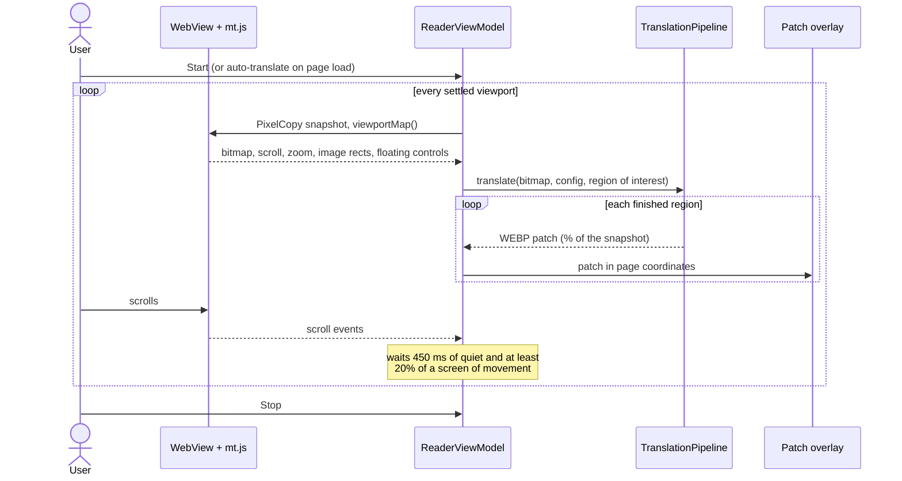
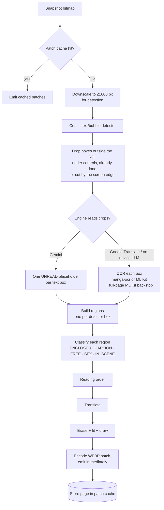

# Translation flow

This document follows a screen from the user pressing **Start** to the translated lettering on the page. The
components are introduced in [ARCHITECTURE.md](ARCHITECTURE.md); how text is found and read is in
[DETECTION_AND_OCR.md](DETECTION_AND_OCR.md).

## Contents

- [The session](#the-session)
- [Capture](#capture)
- [The pipeline](#the-pipeline)
- [Translation](#translation)
- [Erasing and rendering](#erasing-and-rendering)
- [Showing patches while scrolling](#showing-patches-while-scrolling)
- [Failures](#failures)
- [Diagnostics](#diagnostics)
- [Translate page (the page's own text)](#translate-page-the-pages-own-text)

## The session

Screen translation is the reader's only mode. **Start**, auto-translate (per site or globally) and **Re-translate**
all run the same session; Re-translate skips the patch cache and makes a fresh engine call.

Besides a settled scroll, three things start another capture of the same session:

- **Pages that were still downloading.** A capture taken over unfinished images is repeated once they finish (polled
  every second, for up to 3 minutes; a scroll or Stop ends the wait). Bubbles already patched are skipped.
- **A canvas reader that showed nothing yet.** Readers that draw pages on a `<canvas>` (bilibili) show a loading
  picture that the DOM does not announce: a canvas capture that found no text is retried once, 2 s later.
- **A page turn without a scroll**, and **rotation**: see [Showing patches while scrolling](#showing-patches-while-scrolling).

**In the background** (Home, or another app on top), the session is not paused: a screen already in the pipeline is
finished. An on-device model is released as soon as it is idle, at the latest 5 s after its last call, unless the
app comes back first; the next translation then reloads it (see
[ARCHITECTURE.md › Concurrency and memory](ARCHITECTURE.md#concurrency-and-memory)).

## Capture

`ScreenTranslate.captureViewport` produces a `ViewportCapture`:

1. **Wait for the pages.** An image still downloading is painted partly or not at all, so the capture waits up to 3 s
   (polling every 250 ms) until `viewportMap()` reports no pending on-screen image. A stalled image does not hold the
   capture longer; the follow-up capture described above covers it.
2. **Pixels.** `PixelCopy` reads the composited surface, which is exactly what the user sees, including
   hardware-accelerated and canvas content. A software `draw()` is the fallback.
3. **Scroll and zoom** at the moment of capture (read after the wait), so patches can be pinned to the page in CSS
   pixels.
4. **The page map.** `mt.js` `viewportMap()` returns, in CSS pixels relative to the viewport:
   - `images`: visible `` and `<canvas>` elements at least 96 px on a side, each with a key `k` (the image's URL;
     `canvas#n` for the n-th canvas) so a patch can find its image again when the layout moves;
   - `overlays`: controls drawn over the art: fixed or sticky elements, and, for readers that lay their bars over the
     page in their own full-screen layer, any drawn element on top of an image (checked with `elementFromPoint`) that
     is not the page itself. See-through watermark text (opacity or text alpha under 0.5) is not a control;
   - `pending`: how many on-screen images have not finished loading.

   These become the `RegionOfInterest`:
   - `include`: detections outside every image rect are not comic text (menus, comments, ads);
   - `exclude`: detections under a floating control are not translated;
   - `done`: areas already covered by a patch from an earlier capture are not read or translated again.

   The capture also keeps callbacks to ask the page again later: where each image is now (`layoutNow`), how many
   images are still pending, and a 48-cell-wide luminance thumbnail of the viewport (`Thumb`).

## The pipeline

`TranslationPipeline.translate` is the single entry point. Each stage has its own concurrency limit and a 50 s
watchdog.

Key points:

- **Detection is never cached.** Pixels and the region of interest change with every scroll. Only the rendered
  patches are cached, keyed by the image hash, languages, engine and `PIPELINE_VERSION` (bump it whenever rendering
  changes).
- **Filtering happens before OCR.** Boxes the pipeline would drop anyway are skipped before recognition
  (`detectPage(..., skipRead)`), because per-crop manga-ocr is the slowest stage.
- **Edge-cut bubbles** (a text box touching the top or bottom of the snapshot) are deferred. They are translated when
  a later capture shows them whole.
- **Patches stream.** Each region's patch is emitted as soon as it is rendered, so the first bubble appears while the
  rest are still in progress.

## Translation

`BatchingTranslator` sits between the pipeline and the engine:

- **SFX** go through a dictionary, then the SFX cache (Room), then the engine.
- **Duplicates** (the same normalised text) are translated once.
- **Cloud engines** get up to 60 items per call, because their latency is dominated by round trips.
- **On-device LLMs** get the viewport in groups of 4 bubbles in reading order. Each group is rendered as soon as it
  returns, with the previous group's lines passed along as context. Inside the engine, prompts are chunked to at most
  12 items to fit the 4096-token KV cache shared by prompt and reply.
- **Gemini's reading mode.** Each region is cropped with 6% padding, encoded as JPEG (longest side 512) and sent as
  an image right after a text part `Item <i>`. Gemini returns `{i, source, text}`. `withReading` swaps the placeholder
  for the text Gemini read, and derives the glyph size from area per character.

## Erasing and rendering

`RegionRenderer` turns one region and its translation into a patch:

1. **Erase** (`TextEraser`), by region kind:
   - **ENCLOSED / CAPTION:** flood-fill from the container ring to find the background, then fill the glyphs with the
     sampled colour.
   - **FREE / IN_SCENE:** an Otsu glyph mask, a halo test, then ray inpainting (8 rays per pixel, weighted median),
     gated by gradient variance so a smeared result is discarded rather than shown.
   - **Text on art that cannot be cleanly erased:** the source footprint is masked (white on art, the box colour in
     captions) and the translation is fitted into that footprint. The text box is never widened into a panel.
2. **Fit** (`RegionRenderer.fit`): binary search on the font size using two monotonic tests only:
   - the laid-out text height fits the box;
   - the widest unbreakable run (a word; each kanji or kana on its own) fits the width.

   The floor is 12 px. A vertical column may widen (up to 2.5×, staying clear of neighbours) before the text goes
   below 55% of the source glyph size.
3. **Place.** Free text with no container that is drawn over the untouched art grows from its original centre towards
   the lowest-energy direction on a 1/8-scale Sobel map (`Placement`), drifting at most one text height. Once its
   footprint has been erased or masked, it stays exactly on that footprint (moved away, it sat over the art above a
   wiped strip). On a mask the ink is the region's own colour when it contrasts (luminance difference ≥ 100), else
   black on a light mask and white on a dark one.
4. **Encode** the crop as WEBP (lossless at quality 100), positioned as percentages of the snapshot.

## Showing patches while scrolling

- `ReaderViewModel` converts each patch to CSS pixels of the page: (capture scroll + position in the snapshot) ÷
  capture zoom, so the position does not depend on the zoom.
- The Compose overlay draws patches at CSS rect × live zoom minus the live scroll, so they move with the content and
  grow or shrink with it when the page is pinch-zoomed or double-tap-zoomed (the bitmap is scaled, not re-rendered).
  The live zoom comes from every scroll step and `WebViewClient.onScaleChanged`. It takes no touches.
- **Zoom.** A zoom keeps every patch on its art. Once it settles the viewport is captured again; bubbles already
  patched are skipped, so only text the zoom brought into view is read. `viewportMap()` reports rects relative to the
  visual viewport (`visualViewport.offsetLeft/Top`): zoomed in, `getBoundingClientRect` stays relative to the layout
  viewport, which does not follow the part on screen, and anchors computed from it misplaced every patch.
- **Duplicates across captures:** a new patch that mostly overlaps (≥50%) an existing one of similar size is dropped.
  An older fragment mostly covered by a fuller new patch gives way to it.
- **Anchored to their images.** Each patch remembers the page image under its centre (the image's key) and its offset
  from that image's corner. After every settled scroll and every capture, patches whose image is on screen are moved
  back onto it (`reanchor`). This keeps them on the art when the layout moves without the user scrolling: a reader
  re-centring its page in its own layer, or scroll anchoring jumping the offset when a lazy image above the viewport
  finishes loading.
- **Page turns without a scroll.** Paged readers (bilibili) change the picture on a tap or swipe and never scroll.
  800 ms after every finished touch gesture, if the scroll offset is still the last capture's, a fresh thumbnail is
  compared with the one taken at capture, ignoring cells a patch covers (`contentChanged`). A mean luminance change
  above 18 (of 255) counts as a new page: the patches on screen are dropped and the viewport is translated again.
- **Rotation or a split-screen resize** (the WebView's width changes) drops every patch and translates the new
  viewport 1.2 s later, once the page has laid itself out again.
- **A steady bottom bar.** The bar keeps one height (64 dp) whether idle or translating: a bar that changed height
  resized the WebView, and a reader that centres its page then moved the art under patches already made.
- **Memory bound:** patches more than three screens above or below the viewport are pruned and re-made on return.
- A new page load clears the patches; the next settled viewport translates again.

## Failures

| Failure | What the user sees | Offered fix |
|---|---|---|
| `MissingKey` | "Gemini needs an API key" | Opens the key sheet |
| `QuotaExceeded` | "… quota exhausted" | Switch to Google Translate |
| `Network`, `Unavailable`, `Overloaded` | "… is unavailable right now" | Switch to Google Translate (unless it is the one failing) |
| Watchdog timeout | "… took too long" | Scroll or Re-translate |
| `ModelMissing` | The model is not downloaded | Settings › Models |

Transient failures are retried on the same engine first (see [ARCHITECTURE.md](ARCHITECTURE.md#engines)).

## Diagnostics

- **Timings** are logged per screen under the `TranslationPipeline` tag:
  `timing <engine>: decode+detect+ocr=… translate=… render=… total=…`. A failed screen logs `Image failed:` with the
  `EngineFailure` class name, which R8 keeps readable in release builds (`app/proguard-rules.pro`).
- **Session events** are logged under `ScreenSession` (follow-up captures, page turns, patches moved back onto their
  images) and `ScreenCapture` (the page map's image, overlay and pending counts).
- **Debug dump.** `adb shell run-as com.smnexstudio.panelglass mkdir files/debug-dump`, translate a screen, then pull
  `files/debug-dump/<run>/`. It holds `page.png`, `regions.txt` (kind, box, text, translation, erase method and every
  font size tried: `ok`, `T` too tall, `W` a word too wide) and each `patch-N.webp`. Remove the folder afterwards;
  `PipelineDump` does nothing without it.

## Translate page (the page's own text)

A separate path from the one above: ⋮ › *Translate page* translates the site's HTML text (titles, chapter lists,
comments), not the art. It never touches the pipeline.

1. `PageTextTranslation` (feature:browser) opens the translate bar and asks `pt.js` for a sample of the visible text
   and `<html lang>`. `PageTranslator.detect` (core:engine) names the language with ML Kit language identification,
   falling back to `<html lang>`; the user can pick the source instead.
2. `PageTranslator.prepare` downloads the ML Kit language packs for the pair on first use.
3. `pt.js` `collect` hands over untranslated text nodes, visible ones first, about 3,000 characters at a time. They
   are translated a few at a time and written back with `apply`, which keeps each original. Translating from a
   language written without spaces (Japanese, Chinese, Thai) adds a space where a link meets the words around it.
4. While the translation is on, the page is polled every 1.5 s; a `MutationObserver` marks new text (infinite
   scroll, lazy lists) so it is picked up. A new page on the same tab is translated with the same pair.
5. *Show original* (or closing the bar) calls `restore`. Changing either language restores and translates again.

Kotlin and the page talk only through `evaluateJavascript`; there is no JavaScript interface for a page to call.
Page text is never logged. Because translated text can reflow the page, screen-translation patches are cleared
and the screen is translated again when the page text changes.
